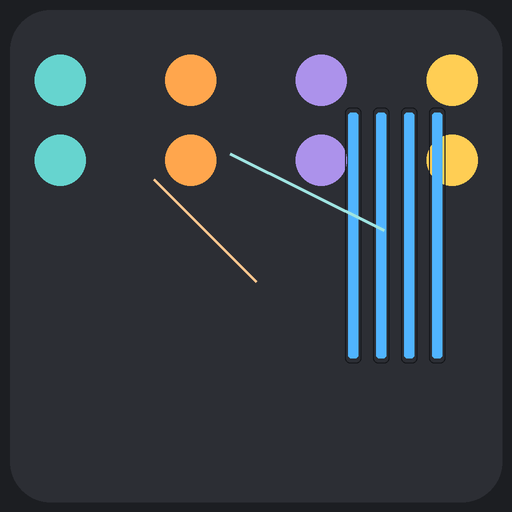

# Plugin Reporter

A native Apple-platform application for music producers and audio engineers that catalogs every audio plugin in your system **and** reports which plugins are used inside the project files of nearly every major DAW. Built with Swift / SwiftUI for **macOS, iPadOS, and iOS**, with **iCloud sync** so a scan you run on your Mac shows up automatically on your iPad and iPhone. Backed by a Cloudflare Worker + Firebase Functions stack for AI features.

> Currently in App Store submission track. See `APP_STORE_PROGRESS.md` for status.



---

## What it does

### 1. System plugin scanner
Scans your machine for installed audio plugins across every modern format and presents them in a searchable, sortable table.

- **Formats:** AU, VST, VST3, AAX, CLAP, LV2
- **Columns:** Name, Publisher, Version, Type, Architectures, Date, Size, Path, Requirement, Obsolete
- **Search syntax:** `type:AU,VST3 pub:fabfilter arch:arm64 req:rosetta path:Spitfire obsolete:true !demo`
- **Exports:** CSV, JSON, HTML (dark theme), PDF (dark theme) — every column included
- **Custom scan paths:** add or remove directories from Settings
- **Right-click row** → Show in Finder, Copy Path

### 2. DAW project file scanner
Reads project files from **19 different DAWs** and reports the plugins each session uses, with version, format, and chain context. Built around a clean `DAWParser` protocol so each parser handles one file format.

| DAW | Parser | DAW | Parser |
| --- | --- | --- | --- |
| Ableton Live (`.als`) | `AbletonLiveParser.swift` | Logic Pro | `LogicProParser.swift` |
| Apple DAWs (shared) | `AppleDAWParser.swift` | MainStage | `MainStageParser.swift` |
| Ardour | `ArdourParser.swift` | Mixbus | `MixbusParser.swift` |
| Bitwig Studio | `BitwigParser.swift` | Pro Tools | `ProToolsParser.swift` + `ProToolsTextParser.swift` |
| Cubase / Nuendo | `CubaseParser.swift` | Reaper | `ReaperParser.swift` |
| Digital Performer | `DigitalPerformerParser.swift` | Reason | `ReasonParser.swift` |
| FL Studio | `FLStudioParser.swift` | Renoise | `RenoiseParser.swift` |
| GarageBand | `GarageBandParser.swift` | Studio One | `StudioOneParser.swift` |
| | | Tracktion / Waveform | `TracktionParser.swift` |

All parsers conform to a single `DAWParser` protocol declaring `dawType`, `supportedExtensions`, and a `parse()` method, so adding a new DAW is a one-file drop-in.

### 3. AI plugin suggestions
Given a project's plugin chain, the app suggests substitutions, missing effects, and "what would Plugin X sound like" alternatives. Powered by a unified `AIFeaturesClient` that abstracts Firebase Functions, CloudKit, and Supabase as interchangeable backends, plus an on-device `PersonalLearningEngine` that learns from your usage.

### 4. Cross-platform with iCloud sync

The app ships as **three first-class apps** from a single codebase:

- **macOS** — full functionality: scan, parse DAW projects, export, manage settings
- **iPadOS** — read-only companion: browse the most recent scan from your Mac, search, view reports
- **iOS / iPhone** — same companion experience optimized for phone

Sync is implemented via **iCloud CloudKit** (`CloudSyncManager.swift`) using a private database in container `iCloud.com.chadlittlepage.PluginReporter`. The flow:

1. You scan plugins on the **Mac** → results upload to your iCloud private database
2. Each upload tags the source device name, so the iPad/iPhone view can show "scanned by Chad's MacBook Pro"
3. Your **iPad** and **iPhone** auto-fetch on launch, so the latest scan is always there
4. The `uploadPlugins` function is gated `#if os(macOS)` — iOS devices are intentional read-only viewers, since plugin scanning requires Full Disk Access on a Mac

The whole sync layer sits behind protocol abstractions in `SyncProtocols.swift` (`PreferencesSyncing`, `ReportsSyncing`), so the backend can swap between **CloudKit** and **Firebase** without touching the call sites. CloudKit is the current default; Firebase is used for the AI features.

### 5. Accessibility
Full VoiceOver support, dynamic type, color-contrast compliance, and labeled controls throughout. See `ACCESSIBILITY_GUIDELINES.md`, `ACCESSIBILITY_LABELS_IMPLEMENTATION.md`, and `audit_accessibility.sh`.

---

## Tech stack

| Layer | Tech |
| --- | --- |
| **App** | Swift 5+, SwiftUI, AppKit/UIKit interop, Combine |
| **Platforms** | macOS, iPad, iPhone (shared core in `Shared/`, platform-specific code in `macOS/`, `iOS/`, `iPad/`, `iPhoness/`) |
| **Architecture** | Protocol-based parsers (`DAWParserProtocol.swift`), MVVM-style view layer, dependency-injected services |
| **AI backend** | Cloudflare Worker (`cloudflare-worker/worker.js`) for edge inference, Firebase Functions (`firebase/functions/`) for orchestration, Gemini integration (`firebase/GEMINI_DEPLOYMENT_GUIDE.md`) |
| **Data** | Firestore (`firebase/firestore.indexes.json`, `firestore.rules`, `FIRESTORE_SCHEMA.md`), CloudKit, optional Supabase (`supabase_schema.sql`) |
| **CI/CD** | Fastlane (`fastlane/`), Xcode build automation, codesigning + notarization |
| **Packaging** | DMG installer (`DMG/`, `build_complete_dmg.sh`, `create-dmg.sh`) |
| **Testing** | `TestFiles/` with sample DAW project files for parser validation |

---

## Repository layout

```
PluginReporter/
├── Shared/                 # cross-platform Swift core
├── macOS/                  # macOS-specific UI
├── iOS/ iPad/ iPhoness/    # iOS family targets
├── Models/                 # data models, AIEnhancedModels.swift
├── Views/                  # SwiftUI views
├── Components/             # reusable UI components
├── Helpers/                # utilities
├── Services/               # service classes (file IO, plugin scanning)
├── Extensions/             # Swift extensions
├── Styles/                 # design system (colors, typography)
├── Assets.xcassets/        # icons, app art
├── Help/                   # in-app help content
├── *Parser*.swift          # 19 DAW parsers (root level)
├── AI*.swift               # AI feature views + client
├── cloudflare-worker/      # edge AI worker (Node)
├── firebase/               # Firebase Functions, Firestore schema, Gemini integration
├── fastlane/               # release automation
├── DMG/                    # DMG packaging assets
├── SampleExports/          # icon previews, screenshot mockups
├── TestFiles/              # sample DAW projects for parser tests
├── Scripts/                # build / sync helper scripts
└── PluginReporter.xcodeproj
```

### Branching model

- `main` — released, App Store submission state
- `development` — integration branch, ongoing work
- `feature/*` — feature branches, merged to `development` via PR
- Dependabot keeps GitHub Actions and dependencies current

---

## Build & run

### Prerequisites
- Xcode 15+ on macOS Sonoma+
- Apple Developer account (for codesigning)
- (Optional) Firebase project for AI features — see `firebase/QUICK_START.md`
- (Optional) Cloudflare account for the edge worker — see `cloudflare-worker/README.md`

### Build the macOS app

```bash
open PluginReporter.xcodeproj
# Select the PluginReporter scheme, choose your team in Signing & Capabilities, then ⌘R
```

If the table starts empty after pressing **Scan**, grant **Full Disk Access** in *System Settings → Privacy & Security* and relaunch.

### Build a signed DMG

```bash
./build_complete_dmg.sh
# Output goes to ./build/
```

### Deploy the AI backend

```bash
cd firebase
firebase deploy --only functions,firestore

cd ../cloudflare-worker
wrangler deploy
```

---

## Status

- **Platform support:** macOS (primary), iPad, iPhone
- **DAW parsers shipped:** 19
- **App Store:** in submission track — see `APP_STORE_PROGRESS.md` and `APP_STORE_SUBMISSION_CHECKLIST.md`
- **Backend:** Firebase Functions + Cloudflare Worker, Gemini AI integrated

## License

Private — all rights reserved.
